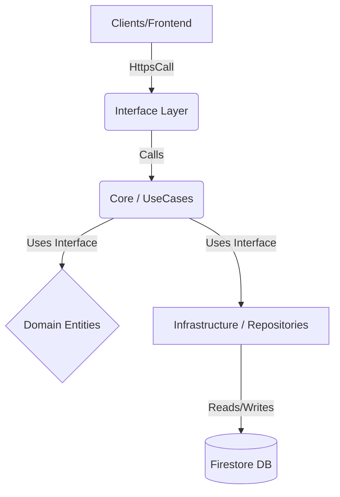

# Inmueble Advisor - Backend (Cloud Functions)

Este directorio (functions/) contiene la lógica de backend migrada desde el frontend para garantizar la seguridad, integridad y escalabilidad de la plataforma.

## 🏗️ Arquitectura (Hexagonal / Clean)

Hemos implementado una arquitectura por capas para desacoplar la lógica de negocio de la infraestructura (Firebase).



### Estructura de Directorios

*   **`src/core/`**: El "Cerebro". Aquí vive la lógica pura.
    *   `entities/`: Definiciones de tipos (ej. `User`, `Lead`).
    *   `usecases/`: Verbos de negocio (ej. `PromoteUser`, `AssignLead`). *Aquí está la regla de negocio*.
*   **`src/infrastructure/`**: Los "Músculos". Implementaciones concretas.
    *   `repositories/`: Clases que hablan con Firestore (ej. `FirebaseUserRepository`).
*   **`src/interface/`**: La "Cara". Puntos de entrada.
    *   `callable/`: Funciones invocables desde el Frontend (ej. `promoteToAdvisor`).
    *   `triggers/`: Funciones disparadas por eventos (ej. `onCreateUser`).

---

## 📚 Catálogo de Endpoints

### 1. `promoteToAdvisor` (Callable)
Eleva el rol del usuario actual a "Asesor", otorgando permisos de acceso al CRM.

*   **Trigger:** Llamada directa desde el cliente (`httpsCallable`).
*   **Entrada:** `{}` (El UID se obtiene del contexto de autenticación).
*   **Reglas de Negocio:**
    *   Requiere autenticación.
    *   Si el usuario ya es `admin`, no hace nada.
    *   Actualiza `role: 'asesor'`, `onboardingCompleto: true` y fecha de registro.
*   **Errores:**
    *   `unauthenticated`: Si no hay usuario logueado.
    *   `internal`: Error de base de datos.
    *   `permission-denied`: (Futuro) Si se infringen reglas de negocio.

---

## 🔌 Guía de Extensión: Cómo crear una nueva función

Sigue estos 3 pasos para mantener la arquitectura limpia:

### Paso 1: Definir la Entidad y Repositorio (Core)
Si es una nueva entidad, créala en `src/core/entities/`. Define la *interfaz* del repositorio.
```typescript
// src/core/entities/Product.ts
export interface Product { ... }
export interface ProductRepository { 
    save(p: Product): Promise<void>; 
}
```

### Paso 2: Crear el Caso de Uso (Core)
Implementa la lógica en `src/core/usecases/`.
```typescript
// src/core/usecases/CreateProduct.ts
export class CreateProduct {
    constructor(private repo: ProductRepository) {}
    async execute(data: any) { ... }
}
```

### Paso 3: Implementar y Exponer (Infra & Interface)
1.  Implementa el repositorio en `src/infrastructure/repositories/`.
2.  Crea la función en `src/interface/callable/` o `triggers/` e inyecta las dependencias.
3.  Exporta la función en `src/index.ts`.

---

## 🛠️ Operaciones y Comandos

### Instalación
```bash
cd functions
npm install
```

### Compilación (Build)
Es necesario compilar TypeScript a JavaScript antes de desplegar o emular.
```bash
npm run build
```

### Ejecutar Logs
Para ver qué está pasando en producción:
```bash
npm run logs
```

### Despliegue (Deploy)
Para subir los cambios a producción (asegúrate de haber compilado primero):
```bash
firebase deploy --only functions
```

---

## ✅ Checklist de Verificación Post-Deploy

1.  **Verificar Compilación:** Ejecuta `npm run build` y asegúrate de que no haya errores de TypeScript.
2.  **Despliegue Exitoso:** Al ejecutar `firebase deploy`, la consola debe decir "Deploy complete" con checks verdes.
3.  **Consola GCP:** Ve a la [Consola de Firebase](https://console.firebase.google.com/) -> Functions y verifica que `promoteToAdvisor` aparezca con estado "OK" y Node.js 18/20.
4.  **Backend Vivo:** En la pestaña "Logs" de la consola, busca "Function execution started" tras probar desde el frontend.

---
**Arquitectura diseñada por Antigravity - Enero 2026**
