# 🔄 MAPA DE FLUJO DE DATOS (Data Lineage)

**Estado:** Actualizado (Sincronizado con Codebase)
**Validación:** `data-manager` + `src/repositories` + `src/services`

Este documento traza la ruta completa del dato, desde un archivo CSV crudo hasta su renderizado en React.

---

## 1. Etapa de Ingesta de Catálogo (Data Ingestion)

El punto de entrada es el CLI `data-manager`.

### 1.1 Fuente (CSV)
Archivos de **Desarrollos, Modelos y Desarrolladores**.
*   **Desafío:** Datos sucios (fechas variadas, strings vacíos).
*   **Solución:** Los **Adapters** (`adapters/index.js`) normalizan nombres de columnas.

### 1.2 Validación Estricta (Zod Layer)
*   **Schema Validation:** Si un campo obligatorio falta o el tipo es incorrecto, la fila se **descarta**.
*   **Result:** Solo datos limpios entran a Firestore.

### 1.3 Post-Procesamiento (Triggers)
1.  **Historial de Precios:** Detecta cambios en `precio.base` y archiva el valor anterior.
2.  **Agregación (Stats):** Suma inventarios y calcula rangos de precios en el Desarrollo padre.
3.  **Geo-Highlights:** Recalcula "Top Desarrollos" por ciudad.

---

## 2. Etapa de Generación de Leads (CRM Flow)

A diferencia del catálogo, los leads nacen en la UI y viajan a la BD.

### 2.1 Origen (User Interaction)
*   **Web Forms:** Landing Pages, Botón "Cotizar", Botón "Agendar Cita".
*   **Input:** El usuario anónimo provee `nombre`, `telefono`, `email`.

### 2.2 Creación (Lead Service)
*   **Validación de Negocio:**
    *   Verifica que vengan `idDesarrollo` e `idDesarrollador`.
    *   Sanea el teléfono.
*   **Persistencia:** `LeadRepository.createLead()` guarda el documento con status `PENDIENTE` e inicia el `statusHistory`.

### 2.3 Procesamiento (Assignment)
1.  **Asesor Interno:** El Admin puede asignar un asesor del equipo (`CrmService.asignarAsesor`).
2.  **Asesor Externo:** Si se trata de un desarrollo B2B, se asigna a un `ExternalAdvisor` previamente registrado.
    *   **ExternalAdvisor:** Se busca por teléfono (WhatsApp key).
    *   **Tracking:** Se actualiza la métrica `leadsAsignadosAcumulados` del asesor externo.

---

## 3. Etapa de Almacenamiento (Firestore)

Base de datos NoSQL orientada a documentos.

*   **Colección `desarrollos`**: Documentos pesados.
*   **Colección `modelos`**: Documentos ligeros.
*   **Colección `leads`**: Datos transaccionales de alta frecuencia.
*   **Colección `external_advisors`**: Directorio de vendedores de las constructoras.

---

## 4. Etapa de Consumo (Frontend Layer)

### 4.1 Data Access Layer (`src/repositories`)
Abstracción pura sobre Firestore.
*   **`CatalogRepository`**: Lee productos.
*   **`LeadRepository`**: Escribe leads y lee dashboard.
*   **`ExternalAdvisorRepository`**: Gestiona el directorio B2B.

### 4.2 Service Layer (`src/services`)
*   **`CatalogService`**: Filtros y Mappers.
*   **`CrmService`**: Máquina de estados del Lead (Nuevo -> Contactado -> Cierre). Gestiona las reglas de negocio para mover un lead de una etapa a otra.

### 4.3 State Management (`CatalogContext`)
*   **Context API:** Cachea el catálogo.
*   **(No cacheamos Leads):** Por seguridad y frescura, los leads se consultan en tiempo real o con SWR.

---

## 5. Diagrama de Flujo Actualizado

```mermaid
graph TD
    subgraph Ingestion [Catálogo Ingest]
    CSV[CSV Files] -->|Data Manager| Valid{Zod Valid?}
    Valid -- Sí --> DB[(Firestore)]
    end
    
    subgraph CRM [CRM Flow]
    User[Usuario Web] -->|Form Submit| Service[Lead Service]
    Service -->|Create| Lead[(Leads Col)]
    
    Admin[Admin/CRM] -->|Assign| Advisor[Asignación]
    Advisor -->|Interno| Staff[Asesor Staff]
    Advisor -->|Externo| Ext[External Advisor]
    
    Ext -->|Update| Metrics[Metrics Update]
    end
    
    subgraph Consumption
    DB -->|Read| Repo[Repositories]
    Repo -->|Logic| App[React App]
    end
```

