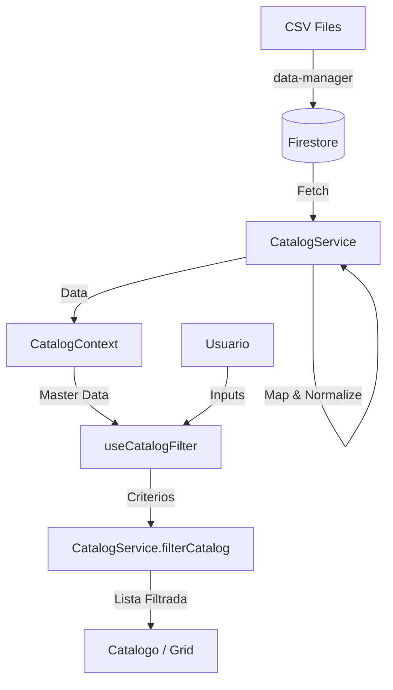

# Mapa de Flujo de Datos y Arquitectura

Este documento describe detalladamente el ciclo de vida de la información dentro de la aplicación **Inmueble Advisor**, desde su origen y almacenamiento hasta su procesamiento, filtrado y visualización en la interfaz de usuario.

---

## 1. Origen y Almacenamiento (Data Ingestion)

Antes de que la aplicación web pueda mostrar algo, los datos deben existir en la Base de Datos.

### 1.1 Fuente Original (CSV)
La información nace en **archivos CSV** masivos gestionados externamente.
- `desarrollos.csv`: Contiene la información de los desarrollos (padres).
- `modelos.csv`: Contiene las unidades individuales (hijos).

### 1.2 Procesamiento de Ingesta (`data-manager`)
Utilizamos una herramienta CLI personalizada (`/data-manager`) para subir estos datos a Firebase.
- **Normalización**: Se limpian caracteres, se parsean fechas (con Timezone `America/Mexico_City`), y se convierten precios a números.
- **Estructura DB**:
    - **Colección `desarrollos`**: Documentos raíz.
    - **Colección `modelos`**: Documentos independientes que apuntan a su padre mediante `idDesarrollo`.
- **Validación**: Se usa `Zod` (en `schemas.js`) para asegurar que los datos cumplan con el tipado estricto antes de subir.

---

## 2. Capa de Servicio (Service Layer)

La aplicación web consulta los datos a través de **Servicios** que ahora utilizan **Inyección de Dependencias**.

### 2.1 `CatalogService` (`src/services/catalog.service.js`)
Es el responsable único de la comunicación con Firestore para inmuebles.

- **Instanciación**: Se crea una instancia única (Singleton) en `serviceProvider.js` inyectándole la conexión a la DB.
- **Métodos Principales**:
    - `obtenerInventarioDesarrollos()`: Trae la lista ligera de todos los desarrollos.
    - `obtenerDatosUnificados(ciudad)`: Trae todos los modelos de una ciudad específica.
    - `obtenerInformacionDesarrollo(id)`: Trae el detalle de un desarrollo y sus modelos asociados.

### 2.2 Normalización de Salida (Mappers)
Cuando los datos bajan de Firebase, pasan inmediatamente por funciones de mapeo internas (`mapModelo` y `mapDesarrollo`) dentro del servicio.
**¿Qué hacen?**
- **Aplanan estructuras**: Extraen `ubicacion.ciudad` a `ciudad` para fácil acceso.
- **Fallbacks de Imágenes**: Si no hay imagen, asignan un placeholder predefinido.
- **Casting de Tipos**: Aseguran que `precio` sea número y `amenidades` sea array.
- **Estado Calculado**: Determinan `esPreventa` basado en flags o fechas.

---

## 3. Gestión de Estado (State Management)

Una vez obtenidos los datos, se almacenan en la memoria del navegador para evitar lecturas excesivas a la BD.

### 3.1 `CatalogContext` (`src/context/CatalogContext.jsx`)
Actúa como la "fuente de verdad" para toda la UI.
- **Carga Perezosa**: Al inicio solo carga la configuración básica. Los modelos pesados solo se cargan cuando el usuario selecciona una ciudad.
- **Cacheo**: Mantiene en memoria (`modelosResult`, `desarrollosResult`) la última consulta realizada.

---

## 4. Lógica de Filtrado y Búsqueda

Aquí es donde la "magia" ocurre para el usuario final.

### 4.1 `useCatalogFilter` (`src/hooks/useCatalogFilter.js`)
Es un **Custom Hook** que conecta la UI con la lógica de filtrado.
- **Persistencia de Filtros**: Guarda las preferencias del usuario (precio, ciudad) en `localStorage` para que no se pierdan al recargar.
- **Reactive**: Escucha cambios en los inputs y recálcula la lista visible.

### 4.2 Métodos Estáticos (`CatalogService.filterCatalog`)
La lógica *pura* de filtrado reside como método estático en el servicio. Recibe la lista completa (Master Data) y aplica:
1.  **Filtro Visibilidad**: Descarta items inactivos (`activo: false`).
2.  **Filtro Precio**: `min <= precio <= max`. Maneja la lógica de "Mostrar sin precio".
3.  **Filtro Habitaciones**: `recamaras >= n`.
4.  **Filtro Texto**: Búsqueda difusa en nombre, colonia, zona y amenidades.
5.  **Filtro Status**: Pre-venta vs Entrega Inmediata (basado en `tiempoEntrega` y flags).

---

## 5. Capa de Presentación (UI Layer)

Finalmente, los datos procesados se pintan en pantalla.

### 5.1 Flujo de Componentes
1.  **`App.jsx`**: Verifica si hay ciudad seleccionada. Si no, muestra `CitySelectorModal`.
2.  **`Catalogo.jsx`**: Pagina principal. Usa `useCatalogFilter` para obtener `modelosFiltrados`.
3.  **`PropertyGrid`**: Recibe la lista filtrada y renderiza una `PropertyCard` por cada ítem.
4.  **`PropertyCard`**: Muestra la información final (Imagen, Precio Formateado, Badges de Preventa).
5.  **`DetalleDesarrollo` / `DetalleModelo`**: Vistas individuales que solicitan datos específicos por ID al servicio.

---

## Diagrama de Resumen

