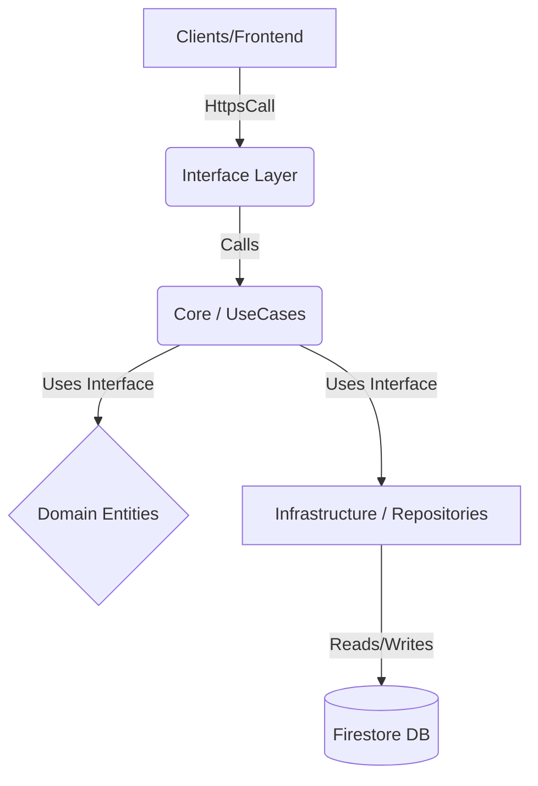

# Inmueble Advisor - Backend (Cloud Functions)

Este directorio (functions/) contiene la lógica de backend migrada desde el frontend para garantizar la seguridad, integridad y escalabilidad de la plataforma.

## 🏗️ Arquitectura (Hexagonal / Clean)

Hemos implementado una arquitectura por capas para desacoplar la lógica de negocio de la infraestructura (Firebase).



### Estructura de Directorios

*   **`src/core/`**: El "Cerebro". Aquí vive la lógica pura.
    *   `entities/`: Definiciones de tipos (ej. `User`, `Lead`).
    *   `usecases/`: Verbos de negocio (ej. `PromoteUser`, `AssignLead`). *Aquí está la regla de negocio*.
*   **`src/infrastructure/`**: Los "Músculos". Implementaciones concretas.
    *   `repositories/`: Clases que hablan con Firestore (ej. `FirebaseUserRepository`).
*   **`src/interface/`**: La "Cara". Puntos de entrada.
    *   `callable/`: Funciones invocables desde el Frontend (ej. `promoteToAdvisor`).
    *   `triggers/`: Funciones disparadas por eventos (ej. `onCreateUser`).

---

## 📚 Catálogo de Endpoints (Sincronizado)
*Última verificación: Enero 2026*

### 1. `promoteToAdvisor` (Callable)
Eleva el rol del usuario actual a "Asesor", otorgando permisos de acceso al CRM.
*   **Trigger:** Llamada directa desde el cliente (`onCall`).
*   **Entrada:** `{}` (El UID se obtiene del contexto de autenticación).

### 2. `scheduledDashboardStats` (Scheduler)
Genera las estadísticas diarias del Dashboard Administrativo.
*   **Trigger:** Automático, todos los días a las 00:00 (Midnight).
*   **Lógica:** Consulta BigQuery (tablas `leads`, `users`, `events`) -> Agrega métricas -> Guarda en Firestore (`dashboard_stats/{YYYY-MM-DD}`).

### 3. `triggerDashboardStats` (Callable)
Disparador manual para recalcular las estadísticas del día actual. Útil para testing o actualizaciones forzadas.
*   **Trigger:** Manual desde panel de administración.
*   **Retorno:** Objeto con las estadísticas generadas.

### 4. `notifyNewUser` (Trigger)
Envía una notificación a Telegram cuando se registra un nuevo usuario.
*   **Trigger:** `auth.user().onCreate`
*   **Secretos Requeridos:** `TELEGRAM_BOT_TOKEN`, `TELEGRAM_CHAT_ID`

### 5. `onLeadCreated` (Trigger)
Envía una notificación a Telegram cuando se genera un nuevo Lead.
*   **Trigger:** Firestore `leads/{leadId}` onCreate
*   **Secretos Requeridos:** `TELEGRAM_BOT_TOKEN`, `TELEGRAM_CHAT_ID`

### 6. `onLeadCreatedMETA` (Callable)
Notifica explícitamente a Meta cuando un lead ha sido creado exitosamente. Sustituye a la antigua lógica reactiva para mayor control.
*   **Trigger:** Llamada directa desde el cliente (`onCall`) tras `addDoc`.
*   **Funcionalidad:**
    *   Envía el evento `Schedule` a la API de Conversiones de Meta (Server-Side).
    *   Garantiza que el evento se envíe una única vez por creación de cita.
*   **Integración:** Utiliza `MetaAdsService` con hashing SHA256 para PII (Email, Phone, Name).

### 7. `onLeadIntentMETA` (Callable)
Rastrea eventos de "Visualización de Contenido" (ViewContent).
*   **Trigger:** Al terminar de cargar los detalles de un desarrollo.
*   **Evento:** `ViewContent` (Estricto).
*   **Funcionalidad:**
    *   Recibe un `metaEventId` generado por el cliente.
    *   Envía el evento a Meta CAPI inmediatamente.

### 8. `onLeadContactMETA` (Callable)
Rastrea la intención de contacto del usuario.
*   **Trigger:** Al hacer clic en botones de "Agendar", "Contactar" o abrir el formulario.
*   **Evento:** `Contact`.
*   **Funcionalidad:**
    *   Captura la intención de contacto antes de que se complete el formulario.

### 9. `onLeadPageViewMETA` (Callable)
Rastrea las visitas a páginas clave (Server-Side).
*   **Trigger:** Al montar componentes de vista (ej. `DevelopmentDetails`).
*   **Evento:** `PageView`.
*   **Funcionalidad:**
    *   Complementa al Pixel de navegador para asegurar el 100% de cobertura de tráfico.

### ⚙️ Configuración de Meta CAPI

Para habilitar el rastreo Server-Side correcto:

1.  **Credenciales:**
    Las constantes se encuentran en `src/core/constants/meta.ts`.
    *   `PIXEL_ID`
    *   `ACCESS_TOKEN` (Debe tener permisos de `leads_access`).
    *   `API_VERSION`: **v19.0**.

2.  **Modo de Prueba (Test Events):**
    Para ver eventos en tiempo real en el Administrador de Eventos de Meta:
    *   Obtén el código de prueba en **Events Manager > Test Events**.
    *   Colócalo en `TEST_EVENT_CODE` dentro de `src/core/constants/meta.ts`.
    *   **IMPORTANT - Eliminación para Producción:** El `TEST_EVENT_CODE` está actualmente definido en archivos de constantes. Para el despliegue final en producción, DEBES limpiar este valor (dejarlo como una cadena vacía o eliminar la clave) tanto en `functions/src/core/constants/meta.ts` como en `src/config/constants.js` para evitar que los eventos se envíen a la herramienta "Test Events" en lugar del conjunto de datos real.

3.  **Logs de Depuración:**
    *   **Frontend (Navegador):** Busca logs con el prefijo `📡 [Meta Pixel]`.
    *   **Backend (Firebase Console):** Busca logs con el prefijo `🛠️ [Meta CAPI]`.
        *   Estos logs muestran el payload completo JSON enviado a Meta, incluyendo los datos de usuario con **SHA256 Hashing**.

---


---


## 🔌 Guía de Extensión: Cómo crear una nueva función (Firebase V2)

Sigue estos 3 pasos para mantener la arquitectura limpia usando la API moderna de Firebase:

### Paso 1: Definir la Entidad y Repositorio (Core)
Si es una nueva entidad, créala en `src/core/entities/`. Define la *interfaz* del repositorio.
```typescript
// src/core/entities/Product.ts
export interface Product { ... }
export interface ProductRepository { 
    save(p: Product): Promise<void>; 
}
```

### Paso 2: Crear el Caso de Uso (Core)
Implementa la lógica en `src/core/usecases/`.
```typescript
// src/core/usecases/CreateProduct.ts
export class CreateProduct {
    constructor(private repo: ProductRepository) {}
    async execute(data: any) { ... }
}
```

### Paso 3: Implementar y Exponer (Infra & Interface)
1.  Implementa el repositorio en `src/infrastructure/repositories/`.
2.  Crea la función en `src/interface/` usando la sintaxis V2 (`onCall`, `onSchedule`, `onRequest`).
```typescript
// src/interface/callable/createProduct.ts
import { onCall } from 'firebase-functions/v2/https';

export const createProduct = onCall(async (request) => {
    // request.data contiene los argumentos
    const repo = new FirebaseProductRepository();
    const useCase = new CreateProduct(repo);
    return await useCase.execute(request.data);
});
```
3.  Exporta la función en `src/index.ts`.

---

## 🛠️ Operaciones y Comandos

### Requisitos Previos
*   **Node.js 22** (LTS 2026)
*   **Firebase CLI** actualizado (`npm install -g firebase-tools`)

### Instalación
```bash
cd functions
npm install
```

### Compilación (Build)
Es necesario compilar TypeScript a JavaScript antes de desplegar o emular.
```bash
npm run build
```

### Despliegue (Deploy)
```bash
firebase deploy --only functions
```

---

## ✅ Checklist de Verificación Post-Deploy

1.  **Verificar Compilación:** Ejecuta `npm run build` y asegúrate de que no haya errores de TypeScript.
2.  **Despliegue Exitoso:** Al ejecutar `firebase deploy`, la consola debe decir "Deploy complete" con checks verdes.
3.  **Consola GCP:** Ve a la [Consola de Firebase](https://console.firebase.google.com/) -> Functions y verifica que `promoteToAdvisor` aparezca con estado "OK" y Node.js 18/20.
4.  **Backend Vivo:** En la pestaña "Logs" de la consola, busca "Function execution started" tras probar desde el frontend.

---
---
### 💡 Nota Didáctica: Por qué Hexagonal?
El uso de la **Arquitectura Hexagonal** en nuestras Cloud Functions permite que la lógica de negocio (el "Cerebro") sea independiente de las herramientas (el "Músculo"). Si en el futuro decidimos cambiar Firestore por otra base de datos, o Firebase Functions por otra plataforma de servidor, los archivos en `src/core/` no deberían cambiar en absoluto. Esto garantiza una aplicación robusta, fácil de testear (Unit Tests) y preparada para el futuro.

**Arquitectura diseñada por Antigravity - Enero 2026**
